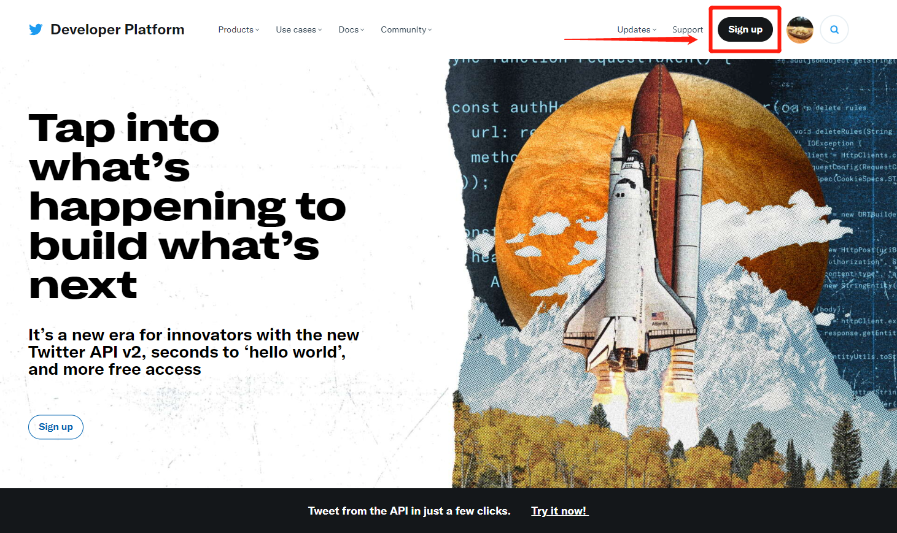
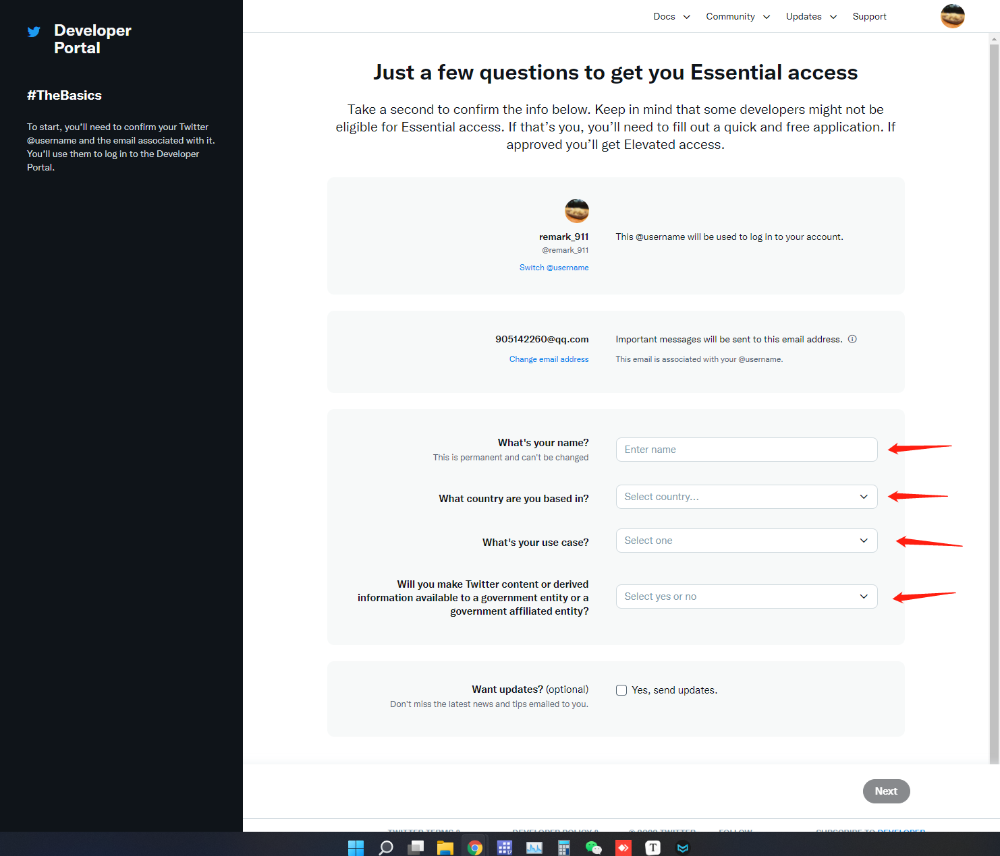
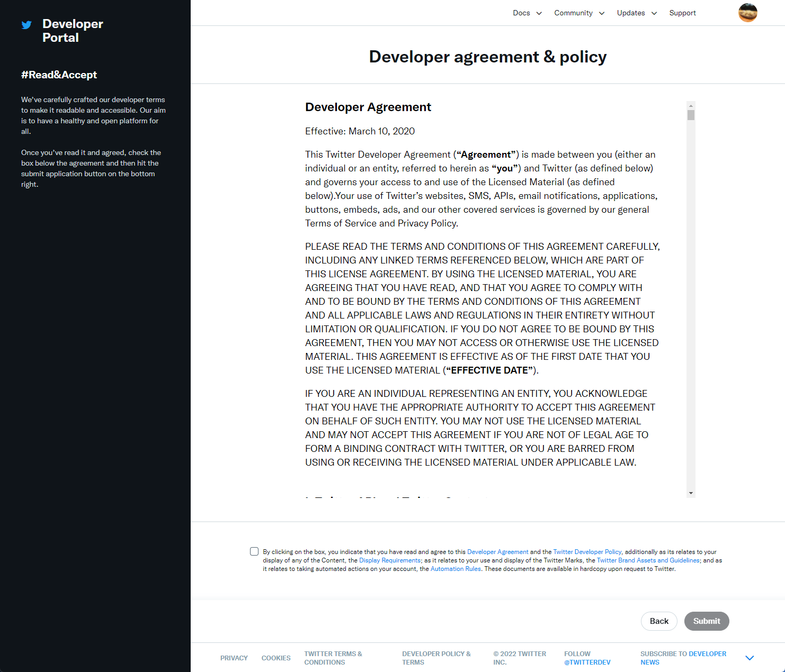
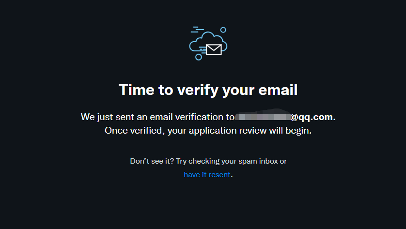
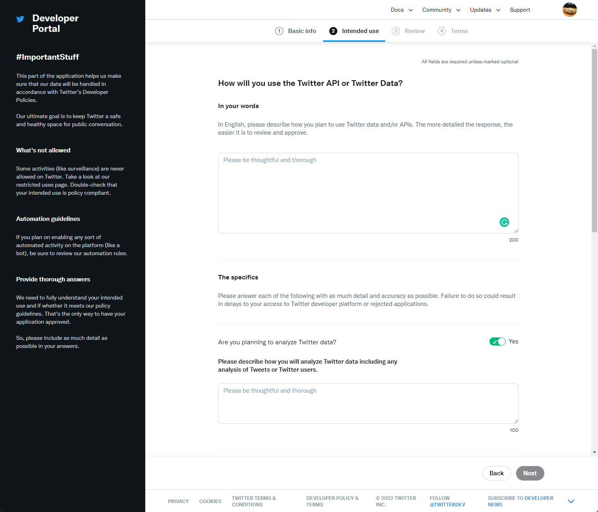
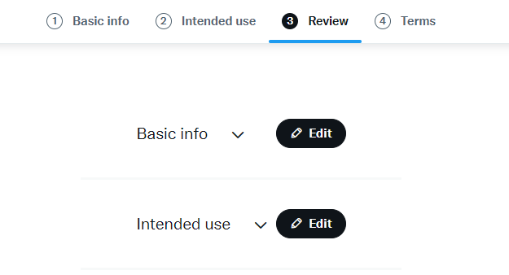
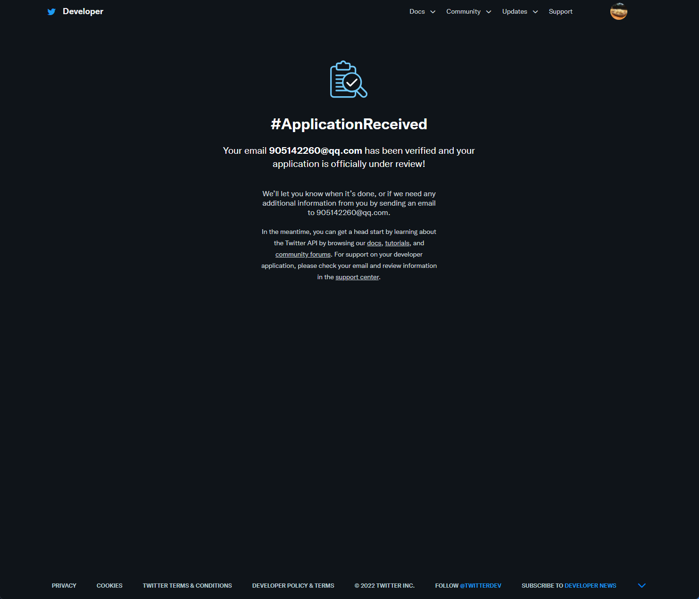
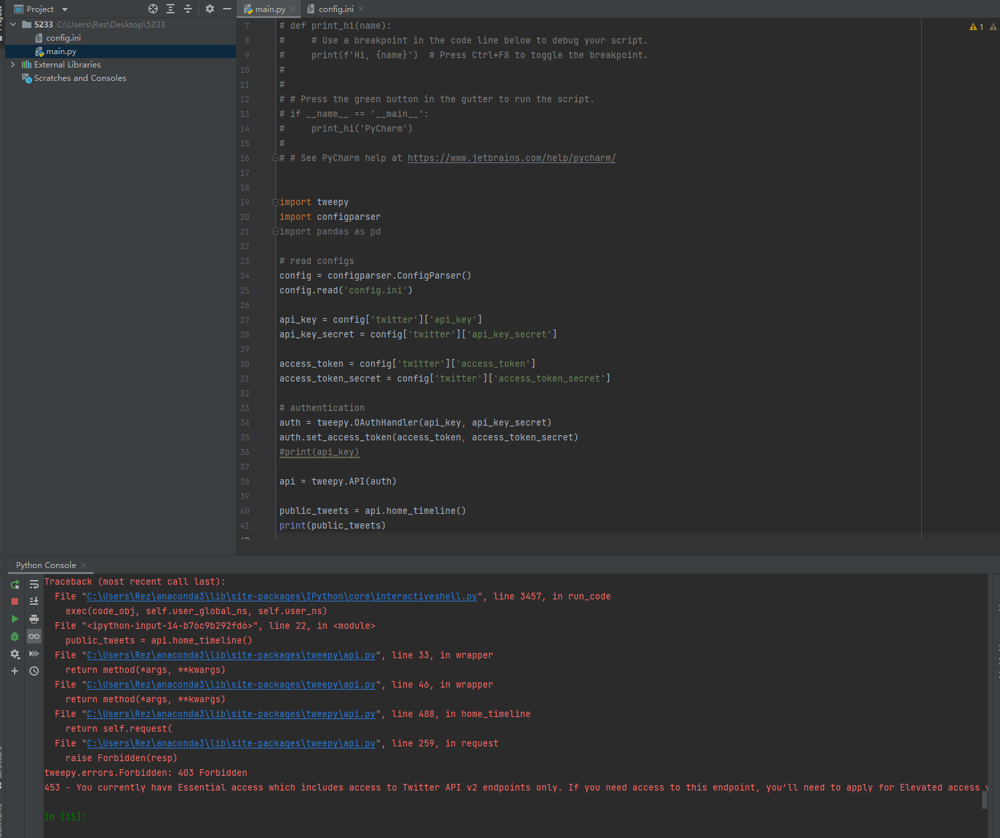

# 1. Exploring Twitter API  and tweets

## Outlines

* \[Create Twitter developer account]\([Twitter API Documentation | Docs | Twitter Developer Platform](https://developer.twitter.com/en/docs/twitter-api))
* Get tweets with \[Tweepy]\([Tweepy Documentation — tweepy 4.6.0 documentation](https://docs.tweepy.org/en/stable/)) and save tweets

***

## Create Twitter developer account

Creating developer account with elevated access, link

Fill all the information to the webpage and next



* Read and accept the developer agreement & policy



* Verify your email



* Answer the questions and submit to Twitter



* Review



* Submit the application and wait for 48 hours



* Generate Access Token and Access Token Secret



***

## Get tweets with \[Tweepy]\([Tweepy Documentation — tweepy 4.6.0 documentation](https://docs.tweepy.org/en/stable/)), and save tweets

Please prepare 2 files in your project folder:

* config.ini

```python
[twitter]

api_key = 
api_key_secret = 

access_token = 
access_token_secret = 
```

* twitter\_api.py
* Please tweepy, configparse and pandas if you nerver install before.

```python
pip install tweepy
pip install configparse
pip install pandas
```

```python
import tweepy
import configparser
import pandas as pd

# read configs
config = configparser.ConfigParser()
config.read('config.ini')

api_key = config['twitter']['api_key']
api_key_secret = config['twitter']['api_key_secret']

access_token = config['twitter']['access_token']
access_token_secret = config['twitter']['access_token_secret']

# authentication
auth = tweepy.OAuthHandler(api_key, api_key_secret)
auth.set_access_token(access_token, access_token_secret)

api = tweepy.API(auth)

public_tweets = api.home_timeline()

# create dataframe
columns = ['Time', 'User', 'Tweet']
data = []
for tweet in public_tweets:
    data.append([tweet.created_at, tweet.user.screen_name, tweet.text])

df = pd.DataFrame(data, columns=columns)

df.to_csv('tweets.csv')
```

* Notes:

Errors: tweepy.errors.Forbidden: 403 Forbidden 453 - You currently have Essential access which includes access to Twitter API v2 endpoints only. If you need access to this endpoint, you’ll need to apply for Elevated access via the Developer Portal. You can learn more here: https://developer.twitter.com/en/docs/twitter-api/getting-started/about-twitter-api#v2-access-level


